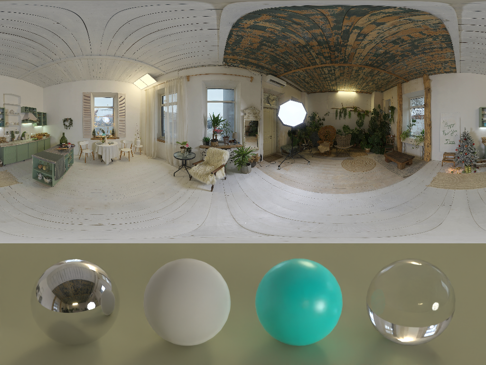
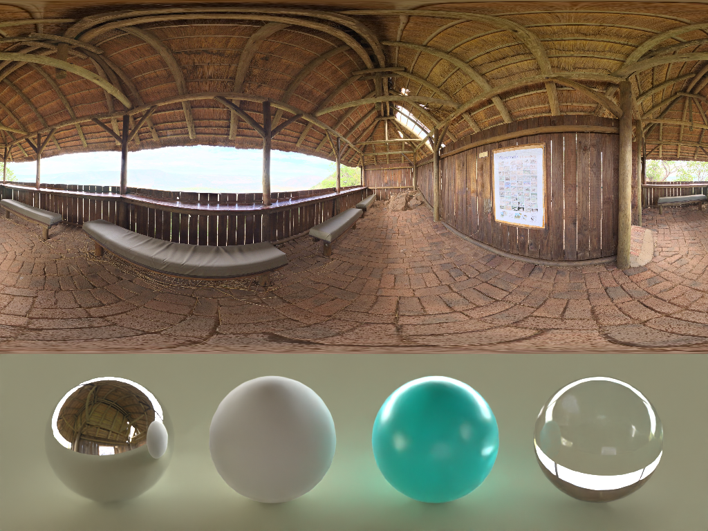
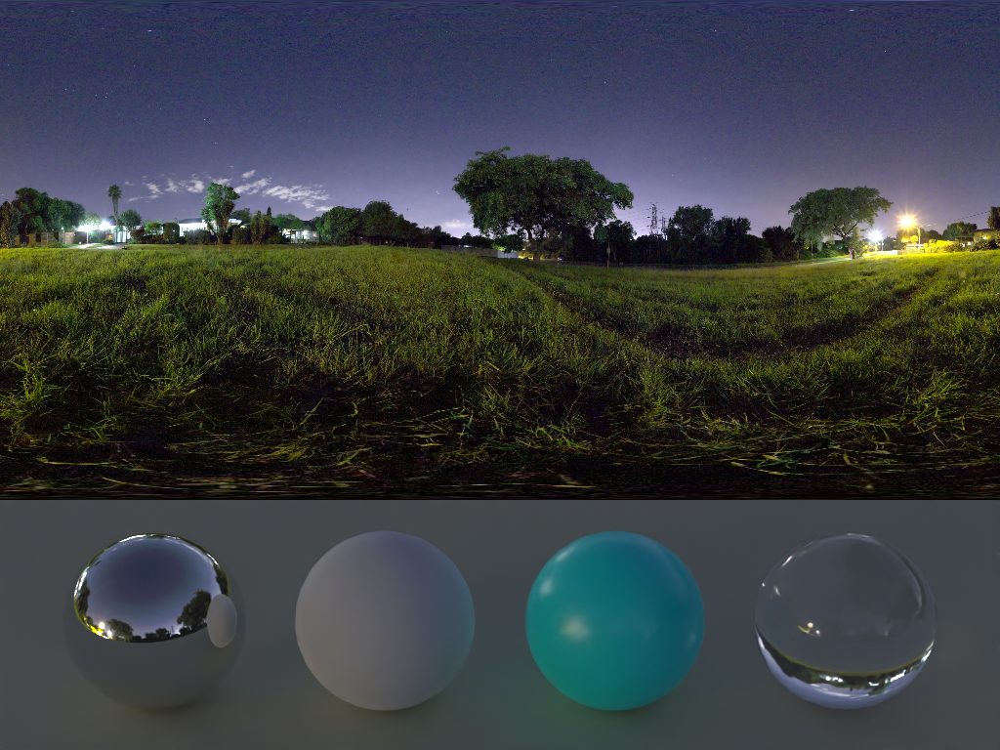
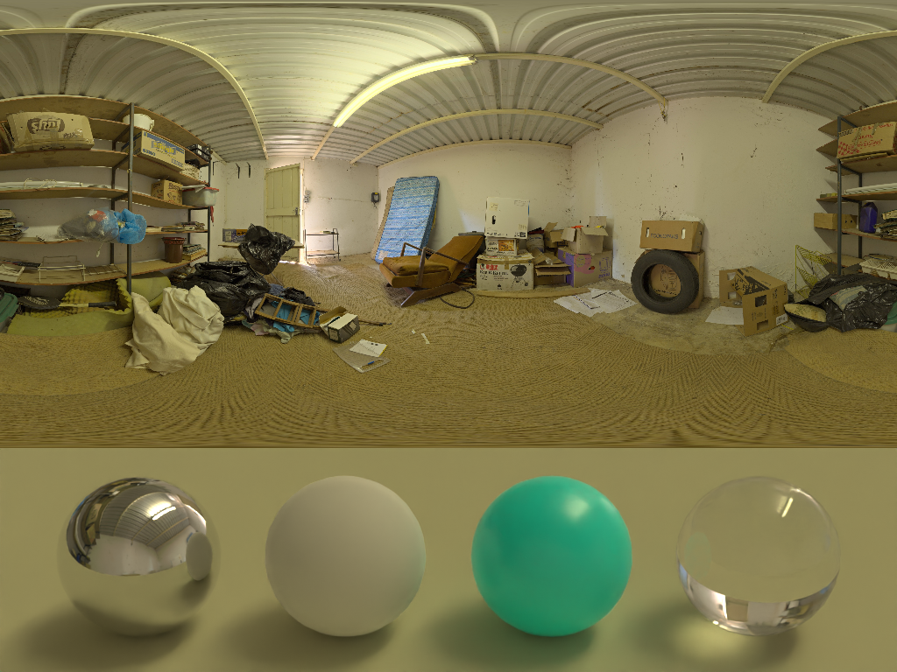

# HDR_reconstruction
Convert a single regular LDR image to HDR image which can be used as an environment map for rendering.






## Installation
```
$ poetry install
```

## Usage
### Train the model
```
$ poetry run python train.py
```

### Inference (create HDR image from LDR image)
```
$ poetry run python predict.py --i <input_image_path> --output <output_image_path>
```

### Generate HDR image and render the scene with Blender (create rendered image listed above)
```
$ ./pred_and_vis.sh <input_image_path> <output_dir> <weight_file>
```
